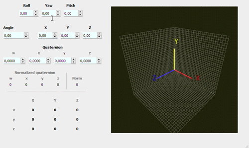

# Quaternion visualisation

The program that shows how quaternions, Euler angles and Direct Cosine Matrix work.



## How to use

### Installing

1. Clone the repo and open repo folder

```bash
git clone git@github.com:Korzhak/QuaternionVisualisation.git
cd QuaternionVisualisation
```

2. Making a virtual environment. Activating it

```bash
virtualenv -p python3 venv
. venv/bin/activate
```
3. Installing requirements

```bash
pip install requirements.txt
```

4. Run program

```bash
python main.py
```
